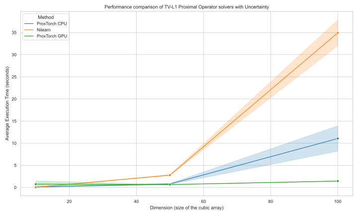

# Summary

`ProxTorch` is a cutting-edge software library tailored for those eager to harness the power of proximal gradient descent optimization within the PyTorch ecosystem. It stands out for its GPU compatibility, thereby ensuring fast and efficient computations. This library bridges the gap between the world of optimization and autodiff, allowing practitioners and researchers to leverage the robustness of proximal algorithms while still operating within the familiar and flexible PyTorch framework.

# Statement of Need

In recent years, the advancements in gradient-based optimization, driven primarily by the surge in deep learning, have been remarkable. Despite these significant strides, there remains an undeniable value in regularized approaches offered by proximal gradient descent, particularly for tackling non-smooth problems. Regrettably, the landscape of constrained and regularized optimization has been somewhat fragmented, with many proximal operator tools, like PyProximal [@pyproximal], being limited to numpy-based environments. On the other hand, PyTorch [@paszke2019pytorch], a prominent deep learning framework known for its dynamic computation graph and GPU support, lacked a native integration with proximal operators.

`ProxTorch` fulfills this pressing need. It not only offers a plethora of proximal operators but also ensures that these operators are compatible with PyTorch tensors. The implications are profound; developers and researchers can now design and optimize complex models involving proximal operations directly in PyTorch without the hassle of switching between different computational environments.

# Available Proximal Operators

### Constraints

| Constraints           | Description                                |
|-----------------------|--------------------------------------------|
| L0Ball                | L0 norm ball constraint                    |
| L1Ball                | L1 norm ball constraint                    |
| L2Ball                | L2 norm ball constraint                    |
| LInfinityBall         | Infinity norm ball constraint              |
| FrobeniusConstraint   | Frobenius norm constraint                  |
| TraceNormConstraint   | Trace norm constraint                      |
| BoxConstraint         | Box-shaped region constraint               |
| RankConstraint        | Matrix rank constraint                     |
| NonNegativeConstraint | Ensures non-negativity of values           |

### Regularizers

| Regularizers          | Description                                |
|-----------------------|--------------------------------------------|
| L1Prox                | L1 norm proximal operator                  |
| L2Prox                | L2 norm proximal operator                  |
| ElasticNetProx        | Combined L1 and L2 norm proximal operator  |
| GroupLassoProx        | Group lasso regularizer                    |
| TV_2DProx             | 2D total variation regularizer             |
| TV_3DProx             | 3D total variation regularizer             |
| TVL1_2DProx           | 2D total variation with L1 regularizer     |
| TVL1_3DProx           | 3D total variation with L1 regularizer     |
| FrobeniusProx         | Frobenius norm proximal operator           |
| TraceNormProx         | Trace norm proximal operator               |
| NuclearNormProx       | Nuclear norm proximal operator             |
| FusedLassoProx        | Fused lasso regularizer                    |
| HuberProx             | Huber loss proximal operator               |
| DummyProx             | Placeholder proximal operator              |
| GraphNet3DProx        | 3D graph net regularizer                   |
| GraphNet2DProx        | 2D graph net regularizer                   |

## **GPU Acceleration: ProxTorch vs. Nilearn Benchmark**

`ProxTorch`, optimized for GPUs, was benchmarked against `Nilearn`, a numpy-based module for NeuroImaging data. Our focus: the Total Variation-L1 (TVL1) proximal operator, prized in imaging for preserving edges and promoting sparsity. We assessed performance on CPUs and GPUs across varying input dimensions.

Key observations:

1. **On CPUs**: `ProxTorch` consistently outperforms `Nilearn`, highlighting its superior optimization even without GPU advantages.
   
2. **GPU Boost**: With GPU, `ProxTorch` scales impressively as data dimensions grow, emphasizing the vast performance benefits of GPU acceleration.
   
3. **Dimensional Considerations**: While GPUs benefit all data sizes, the advantage becomes especially pronounced for larger datasets, reinforcing `ProxTorch` as the go-to for hefty optimization tasks.

# Documentation

For users keen to delve deeper into `ProxTorch` and its offerings, comprehensive documentation is available at [https://proxtorch.readthedocs.io/en/latest/](https://proxtorch.readthedocs.io/en/latest/). This documentation covers a wide spectrum of topics, from basic setup and usage to advanced optimization techniques, providing users with a holistic understanding of the library.

# Acknowledgements

JC is grateful for the support from the EPSRC-funded UCL Centre for Doctoral Training in Intelligent, Integrated Imaging in Healthcare ( i4health) (EP/S021930/1) and the Department of Health’s NIHR-funded Biomedical Research Centre at University College London Hospitals.

# References
